# [📈 Live Status](https://demo.upptime.js.org): <!--live status--> **🟨 Degraded performance**

This repository contains the open-source uptime monitor and status page for [Upptime](https://upptime.js.org), powered by [Upptime](https://github.com/upptime/upptime).

With [Upptime](https://upptime.js.org), you can get your own unlimited and free uptime monitor and status page, powered entirely by a GitHub repository. We use [Issues](https://github.com/upptime/upptime/issues) as incident reports, [Actions](https://github.com/Ckal/uptime/Ckal/uptime/actions) as uptime monitors, and [Pages](https://demo.upptime.js.org) for the status page.

<!--start: status pages-->
<!-- This summary is generated by Upptime (https://github.com/upptime/upptime) -->
<!-- Do not edit this manually, your changes will be overwritten -->
<!-- prettier-ignore -->
| URL | Status | History | Response Time | Uptime |
| --- | ------ | ------- | ------------- | ------ |
|  [Bofrost.com](https://www.bofrost.com) | 🟩 Up | [bofrost-com.yml](https://github.com/Ckal/Uptime/commits/HEAD/history/bofrost-com.yml) | 

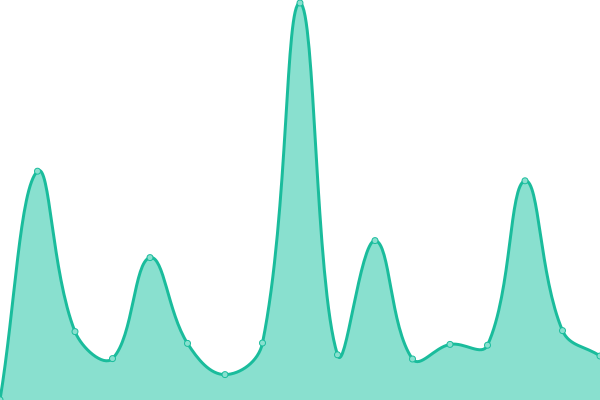 448ms
     
 | 

<a href="https://Ckal.github.io/Uptime/history/bofrost-com">99.60%</a>
    

|  [Bofrost.de](https://www.bofrost.de) | 🟩 Up | [bofrost-de.yml](https://github.com/Ckal/Uptime/commits/HEAD/history/bofrost-de.yml) | 

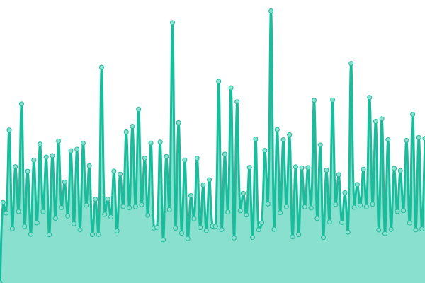 911ms
     
 | 

<a href="https://Ckal.github.io/Uptime/history/bofrost-de">92.15%</a>
    

|  [Bofrost.at](https://www.bofrost.at) | 🟩 Up | [bofrost-at.yml](https://github.com/Ckal/Uptime/commits/HEAD/history/bofrost-at.yml) | 

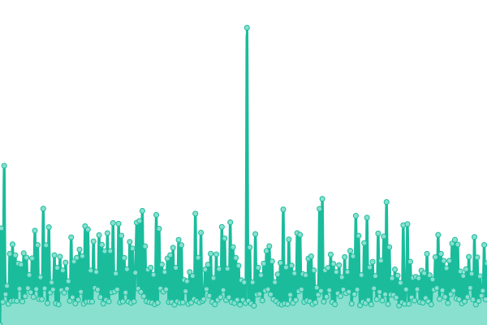 1143ms
     
 | 

<a href="https://Ckal.github.io/Uptime/history/bofrost-at">73.43%</a>
    

|  [Bofrost.nl](https://www.bofrost.nl) | 🟩 Up | [bofrost-nl.yml](https://github.com/Ckal/Uptime/commits/HEAD/history/bofrost-nl.yml) | 

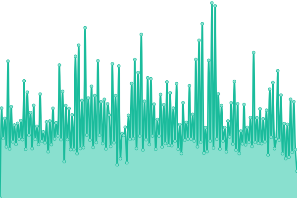 627ms
     
 | 

<a href="https://Ckal.github.io/Uptime/history/bofrost-nl">100.00%</a>
    

|  [Bofrost.be](https://www.bofrost.be) | 🟨 Degraded | [bofrost-be.yml](https://github.com/Ckal/Uptime/commits/HEAD/history/bofrost-be.yml) | 

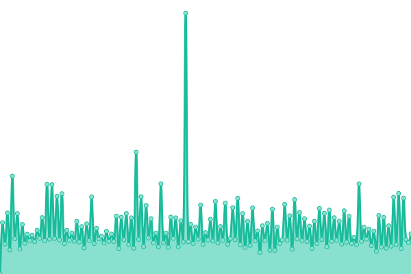 1372ms
     
 | 

<a href="https://Ckal.github.io/Uptime/history/bofrost-be">59.59%</a>
    

|  [Bofrost.lu](https://www.bofrost.lu) | 🟩 Up | [bofrost-lu.yml](https://github.com/Ckal/Uptime/commits/HEAD/history/bofrost-lu.yml) | 

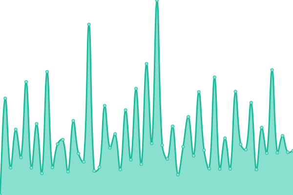 924ms
     
 | 

<a href="https://Ckal.github.io/Uptime/history/bofrost-lu">98.42%</a>
    

|  [Bofrost.ch](https://www.bofrost.ch) | 🟩 Up | [bofrost-ch.yml](https://github.com/Ckal/Uptime/commits/HEAD/history/bofrost-ch.yml) | 

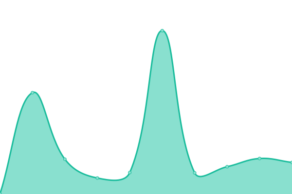 995ms
     
 | 

<a href="https://Ckal.github.io/Uptime/history/bofrost-ch">99.33%</a>
    

|  [Bofrost.fr](https://www.bofrost.fr) | 🟩 Up | [bofrost-fr.yml](https://github.com/Ckal/Uptime/commits/HEAD/history/bofrost-fr.yml) | 

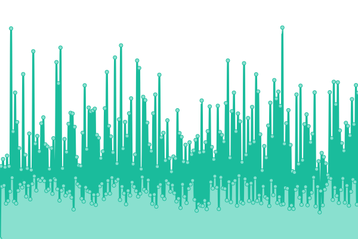 919ms
     
 | 

<a href="https://Ckal.github.io/Uptime/history/bofrost-fr">97.49%</a>
    

|  [Bofrost.gr](https://www.bofrost.gr) | 🟩 Up | [bofrost-gr.yml](https://github.com/Ckal/Uptime/commits/HEAD/history/bofrost-gr.yml) | 

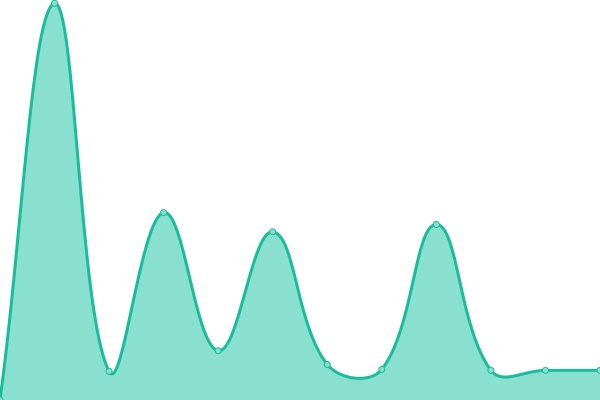 1286ms
     
 | 

<a href="https://Ckal.github.io/Uptime/history/bofrost-gr">99.69%</a>
    

|  [Bofrost.it](https://www.bofrost.it) | 🟩 Up | [bofrost-it.yml](https://github.com/Ckal/Uptime/commits/HEAD/history/bofrost-it.yml) | 

 373ms
     
 | 

<a href="https://Ckal.github.io/Uptime/history/bofrost-it">100.00%</a>
    

|  [Bofrost.hr](https://www.bofrost.hr) | 🟩 Up | [bofrost-hr.yml](https://github.com/Ckal/Uptime/commits/HEAD/history/bofrost-hr.yml) | 

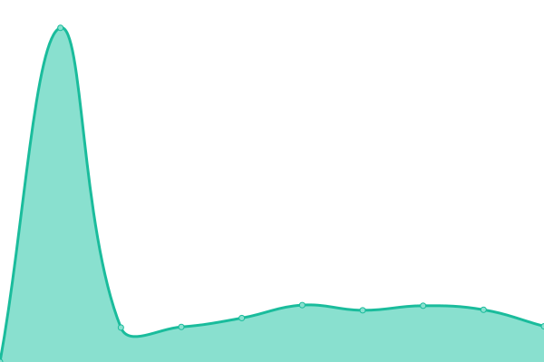 2286ms
     
 | 

<a href="https://Ckal.github.io/Uptime/history/bofrost-hr">99.84%</a>
    

|  [Bofrost.si](https://www.bofrost.si) | 🟩 Up | [bofrost-si.yml](https://github.com/Ckal/Uptime/commits/HEAD/history/bofrost-si.yml) | 

 1189ms
     
 | 

<a href="https://Ckal.github.io/Uptime/history/bofrost-si">100.00%</a>
    

|  [Bofrost.es](https://www.bofrost.es) | 🟩 Up | [bofrost-es.yml](https://github.com/Ckal/Uptime/commits/HEAD/history/bofrost-es.yml) | 

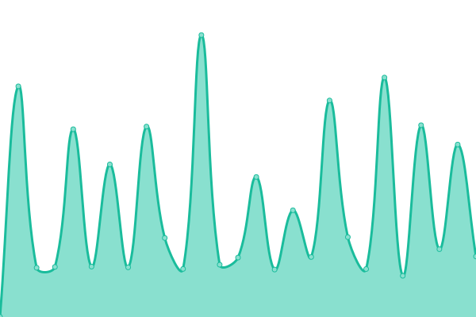 601ms
     
 | 

<a href="https://Ckal.github.io/Uptime/history/bofrost-es">100.00%</a>
    

<!--end: status pages-->

[**Visit our status website →**](https://demo.upptime.js.org)

## 📄 License

- Powered by: [Upptime](https://github.com/upptime/upptime)
- Code: [MIT](./LICENSE) © [Upptime](https://upptime.js.org)
- Data in the `./history` directory: [Open Database License](https://opendatacommons.org/licenses/odbl/1-0/)
